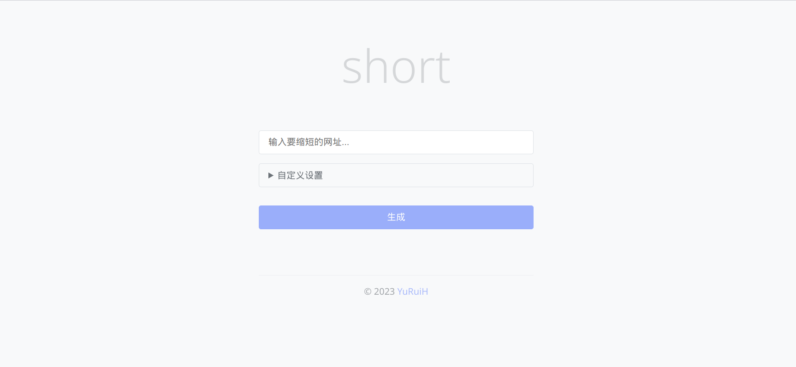
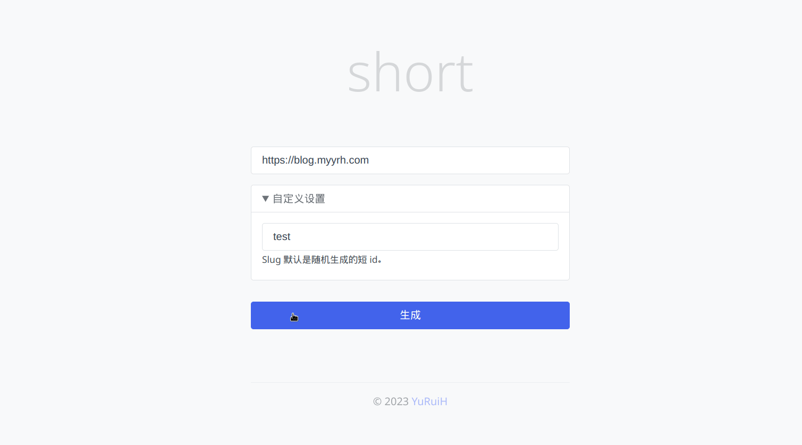

<div align="center">

# go-cqhttp

_✨ 一个基于[Gin](https://github.com/gin-gonic/gin)和[Redis](https://redis.io)实现的短链跳转程序
</div>

<p align="center">
    <a href="https://raw.githubusercontent.com/xiao0ne/url-GO-to/main/LICENSE">
    
    </a>
    <a href="https://goreportcard.com/report/github.com/xia0ne/url-GO-to">
    
    </a>
</p>

### 项目截图



### 实现细节
#### URL加密
- 如果用户自行提供了`Slug`,则使用用户的`Slug`
- 实现方法是基于`unix`时间戳转62进制生成字符串，保证不重复
- ```go
  func Base62(url string) string {
	id := time.Now().Unix()
	var baseChars = []byte("abcdefghijklmnopqrstuvwxyzABCDEFGHIJKLMNOPQRSTUVWXYZ0123456789")
	var result []byte
	for id > 0 {
		idx := id % 62
		result = append([]byte{baseChars[idx]}, result...)
		id /= 62
	}
	return string(result)
  }

#### redis
- 实现了简单的`SET` `GET` `Exists` 操作

### 使用方法
1. 在`config.yaml` 填写好配置
```yaml
config: # 系统配置
  base_url: 127.0.0.1:8000/api/ # 跳转的链接
  port: :8000 # gin运行端口
redis: # redis配置
  Addr: 127.0.0.1:6379 #redis地址
  Passwd: # 密码
  DB: 0 # 链接的数据库
  CacheDuration: "4380h" #设置超时， 以小时为单位
```
2. `go build` 或 `go run .`
3. 执行
4. 打开`127.0.0.1:{your_port}` 查看服务

### 常见问题
- Q:为什么运行不起来
  - A: 检查下端口有没有被占用或者`redis`配置是否成功

### TODO
- [x] 使用`redis`缓存
- [ ] `Goroutine` 优化性能
- [ ] 分布式处理架构
- [ ] 增加后台可视化